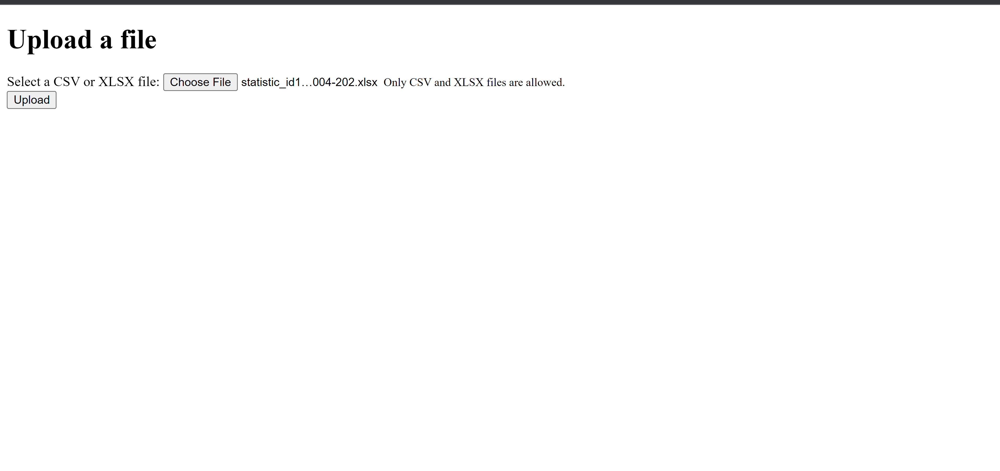
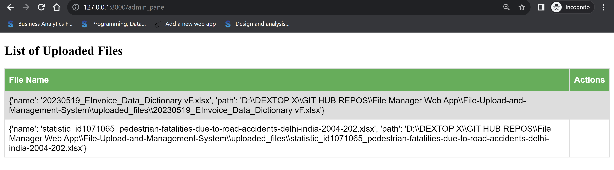

# File Upload and Management System

Welcome to the File Upload and Management System project! This project serves as the initial task for my internship, where I've developed a web application that allows users to upload files and provides an admin panel to manage and view the uploaded files.

## Table of Contents
- [Introduction](#introduction)
- [Features](#features)
- [Screenshots](#screenshots)
- [Getting Started](#getting-started)
- [Usage](#usage)
- [Admin Panel](#admin-panel)
- [Contributions](#contributions)
- [License](#license)

## Introduction

During the course of my internship, I've created a web-based application that enables users to conveniently upload files of various types. This project aims to demonstrate my skills in web development and provide a functional solution for file management.

## Features

- **File Upload:** Users can easily upload files through a user-friendly interface.
- **Admin Panel:** The admin panel allows authorized personnel to view and manage the uploaded files.
- **File Listing:** All uploaded files are listed with details like filename, upload date, and file type.
- **Security:** User authentication and authorization mechanisms are implemented to ensure data security.
- **Responsive Design:** The application is designed to work seamlessly on different devices and screen sizes.

## Screenshots

*Figure 1: The homepage where users can upload their files.*

*Figure 2: The admin panel displaying the list of uploaded files.*

## Getting Started

Follow these steps to get the project up and running on your local machine:

1. Clone the repository: `git clone https://github.com/kamalshowgit/File-Upload-and-Management-System`
2. Navigate to the project directory: `cd File-Upload-and-Management-System`
3. Install dependencies: `pip install`
4. Set up the database (if required): Refer to the database setup documentation.

## Usage

1. Access the application through your web browser.
2. Users can upload files by clicking the "Upload" button on the homepage.
3. Admin users can log in to the admin panel to view and manage uploaded files.

## Admin Panel

Authorized administrators can access the admin panel by navigating to `/admin` and logging in using their credentials. In the admin panel, they can:

- View the list of uploaded files.
- Download files or remove files if necessary.
- Perform administrative actions as required.

## Contributions

This project was developed as part of my internship task and is currently not open for external contributions. However, feedback is always welcome and appreciated.

## Future Enhancements
While the current version of the File Upload and Management System offers valuable features, there are several exciting enhancements that could be implemented in the future:

Database Integration: In the current version, file data might be stored locally. Integrating a database like MySQL or MongoDB could provide benefits such as improved scalability, better data organization, and enhanced search capabilities.

File Access Control: Implementing user-specific access controls to uploaded files can enhance security and data privacy. This could involve assigning access levels to users and allowing different levels of file access based on roles.

Download and Viewing Permissions: Extend the admin panel to allow administrators to control who can view and download specific files. This feature could be particularly useful for sharing sensitive documents within an organization.

Password-Protected Admin Panel: Adding an extra layer of security to the admin panel by implementing password protection or two-factor authentication can prevent unauthorized access and safeguard sensitive data.

User Comments and Annotations: Enabling users to leave comments or annotations on uploaded files can enhance collaboration and communication within a team.

File Versioning: Incorporating version control for uploaded files could be valuable, allowing users to track changes and revert to previous versions when needed.

File Type Handling: Enhance the system to handle different file types more effectively. For instance, supporting image previews, document previews, and video playback directly within the application.

Real-Time Notifications: Implement notifications to alert users and administrators when new files are uploaded, files are modified, or important actions are taken within the system.

Advanced Search and Filtering: Enhance the admin panel with advanced search and filtering options, allowing administrators to quickly locate specific files based on criteria such as date, type, or user.

User Profiles: Create user profiles that enable users to manage their uploaded files, track their activity, and modify their settings.

These are just a few ideas to consider for expanding and improving the functionality of the File Upload and Management System in the future. As the project evolves, incorporating these enhancements can make the application even more valuable and versatile.

---

Feel free to explore, use, and learn from this project. If you have any questions or suggestions, please feel free to contact me. Thank you for checking out my project!
